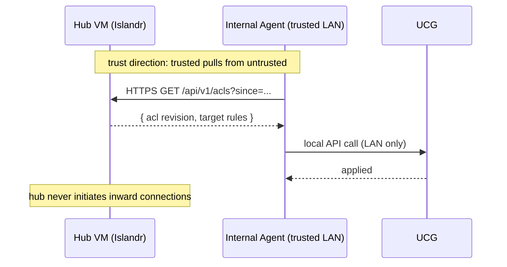

# ADR-0005 — Firewall enforcement stays on the hub VM; no UCG API access from the hub

**Status:** Accepted
**Date:** 2026-05-30
**Deciders:** Christian Cohnen

## Context

Islandr's threat model centers on one fact: **the hub VM is internet-exposed.** It listens on a public UDP port for WireGuard and serves the admin UI over HTTPS. Any externally-reachable host with credentials to attack must be assumed compromisable.

The technically tempting next step is "let Islandr also configure the UniFi Cloud Gateway sites": admin defines ACLs in Islandr, Islandr pushes the corresponding firewall rules onto each site's UCG via its API. End-to-end enforcement, one source of truth, very clean.

The trust-direction problem: to push rules to UCG, the hub VM needs UCG credentials and an outbound connection — or worse, an inbound one — into the trusted internal network. A compromise of the hub VM then directly compromises the internal LAN's firewall.

Three classes of attacker we care about:

- **A1**: Generic internet scanner / opportunistic exploit against the public WireGuard or HTTPS endpoint.
- **A2**: Authenticated user (low privilege) attempting privilege escalation.
- **A3**: Targeted attacker who has obtained admin access to the hub VM and is pivoting to internal systems.

A3 is the one this ADR is about. We accept that A3 means Islandr's own ACLs and audit log are no longer trustworthy on the hub. We do *not* accept that A3 should hand the attacker the keys to reconfigure the internal firewall.

## Decision

**Islandr enforces ACLs only on the hub VM, via nftables ([ADR-0003](0003-nftables-replaces-ufw.md)).** The hub VM holds no UCG credentials and makes no API calls into the trusted network.

Concretely:

- The hub VM's network role is: terminate WireGuard, filter traffic between WG peers and the hub's network interfaces, route to upstream gateways via static routes only.
- UCG site tunnels are **static**: `AllowedIPs`, routes, and any UCG-side ACLs are configured on the UCG itself, manually or via UCG-native tooling. Islandr never touches them.
- Internal LAN segmentation (which VLAN can reach which) stays under UCG control. Islandr is invisible to that decision.
- There is no Islandr code path that initiates a TCP connection from the hub VM into the trusted network. The hub VM is treated as untrusted by everything behind it.

For **v2**, ACL push into UCG happens via a **pull-mode agent** running inside the trusted network:

The agent polls Islandr for ACL changes and applies them to UCG using a credential that lives only inside the trusted network. The hub VM never sees that credential and never initiates the connection. Compromising the hub gives an attacker the ability to *publish* malicious ACL change instructions, but the agent's policy decides whether to apply them — and the operator owns that policy.

## Alternatives considered (Pugh Matrix)

Baseline: **hub-only enforcement; pull-mode agent in v2** (the decision).

| Criterion (weight)            | Hub-only + pull agent (baseline) | Push to UCG from hub | Hub-only forever (no UCG ever) | Bidirectional sync |
|-------------------------------|----------------------------------|-----------------------|--------------------------------|---------------------|
| Blast radius if hub compromised (5) | 0                        | -1                    | +1                             | -1                  |
| End-to-end ACL enforcement (4)| 0                                | +1                    | -1                             | +1                  |
| Operational complexity (3)    | 0                                | +1                    | +1                             | -1                  |
| Time-to-v1 (3)                | 0                                | -1                    | +1                             | -1                  |
| Audit-log integrity under hub compromise (3) | 0                | -1                    | 0                              | -1                  |
| Multi-vendor extensibility (Mikrotik, OPNsense, …) (2) | 0      | -1                    | 0                              | 0                   |
| **Weighted total**            | **0**                            | **−4**                | **+2**                         | **−9**              |

Notes:

- **Push to UCG from hub** scores well on "end-to-end ACL" and "operational complexity" but fails the test that motivated this ADR: it puts UCG credentials on a public-facing host. That's the −5 we're not willing to spend.
- **Hub-only forever** scores +2 and is honest. It's the v1 decision but not the v2 ambition. We want eventual end-to-end ACL enforcement; the pull agent gets us there without surrendering the trust boundary.
- **Bidirectional sync** is the worst of every world: most complexity, most credentials in play, no real benefit over the pull model.

The +2 for "Hub-only forever" is real — we just choose to accept slightly worse short-term completeness in exchange for a path to v2 that doesn't require a second ADR superseding this one.

## Consequences

**Positive**

- Hub-VM compromise blast radius is bounded to: WireGuard peer state, the Islandr database, and the nftables ruleset on the hub. UCG remains uncompromised.
- No UCG credentials on the hub. No outbound API access to internal systems. No inbound connection from hub to LAN.
- The trust-direction story is simple enough to explain to an operator in three sentences.

**Risks created**

- **R-040** — UCG-side firewall rules drift from Islandr's intent because two humans (or one human + Islandr) configure two firewalls independently. v1 has no enforcement that the UCG firewall reflects the Islandr ACL model. Mitigation: documentation that UCG rules are the operator's responsibility in v1; v2 agent closes the gap.
- **R-041** — End users on the same VLAN behind a UCG site can reach each other regardless of Islandr's ACL, because Islandr's enforcement applies only to traffic crossing the hub. Mitigation: documented as a known v1 limitation; operators wanting intra-site ACL use UCG-native zones.
- **R-042** — The v2 agent introduces a new component to design, build, and update. Plan accordingly; do not block v1 on it.
- **R-043** — A compromised hub can publish malicious ACL changes that the v2 agent then applies. Mitigation in v2: agent-side policy (e.g. require operator approval for ACL changes outside an expected diff envelope); audit trail on the agent side independent of the hub.

**Accepted trade-offs**

- v1 ACL enforcement is partial: hub-traversing traffic only. Operators who need intra-site enforcement do it on UCG by hand.
- The pull-mode agent is more work than a push-mode integration. We pay that cost on purpose.

## References

- [docs/prd.md](../prd.md) — §10 security model, NG-1 (no UCG API integration in v1)
- [docs/adr/0003-nftables-replaces-ufw.md](0003-nftables-replaces-ufw.md) — what enforcement on the hub looks like
- [wg-dashboard-plan.md](../../wg-dashboard-plan.md) — original threat-model framing
