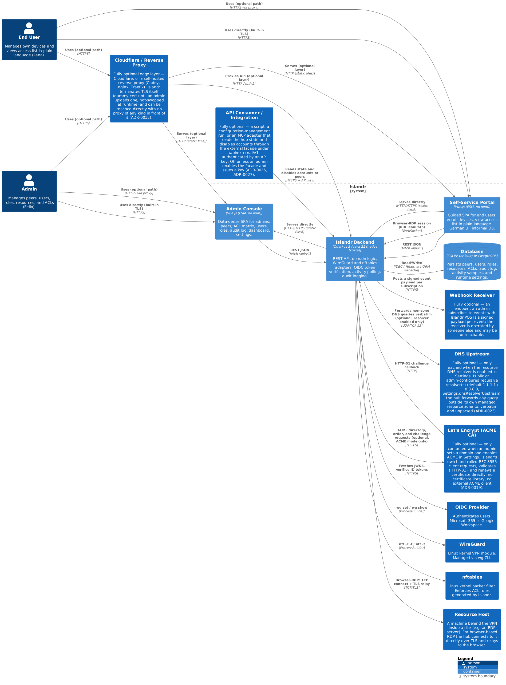
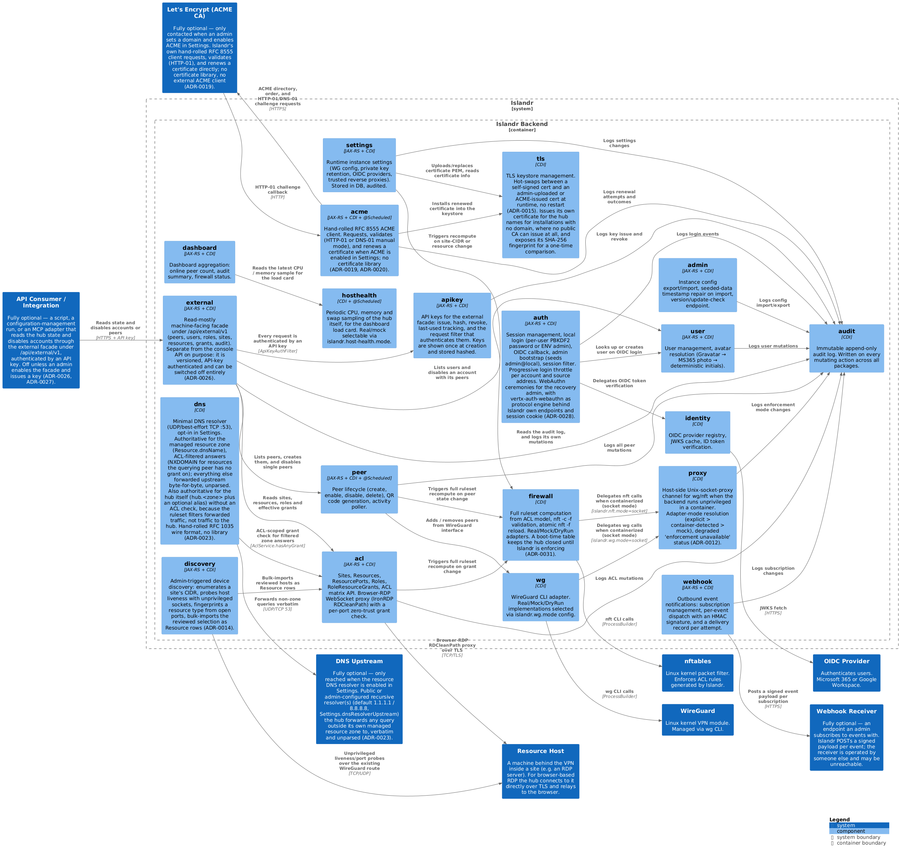

# 5. Building Block View

## 5.1 Level 1 — System Context

See [Chapter 3](03-system-scope-and-context.md). The C4 Level 1 diagram is there.

## 5.2 Level 2 — Containers

### C4 Level 2 — Container View

### Container descriptions

| Container | Technology | Responsibility | Source |
|---|---|---|---|
| **Admin Console** | Vue.js (ESM, no npm) | Data-dense SPA for admins. Peers, ACL matrix (Roles × Resources), users, roles, audit log, dashboard, runtime settings. | `src/main/resources/META-INF/resources/js/` |
| **Self-Service Portal** | Vue.js (ESM, no npm) | Guided SPA for end users. Enroll devices (3-step flow), view access list in plain language. German UI, informal _Du_. | `src/main/resources/META-INF/resources/js/views/MyAccessView.js` |
| **Islandr Backend** | Quarkus 3 / Java 21 | REST API under `/api/v1/`, domain logic, WireGuard and nftables adapters, OIDC verification, activity polling, audit logging. Ships as a GraalVM native binary. | `src/main/java/de/chriscohnen/islandr/` |
| **Database** | SQLite (default) or PostgreSQL | Persistent storage for all domain entities, activity samples, audit log, and runtime settings. Schema managed by Flyway. | `src/main/resources/db/migration/` |

## 5.3 Level 3 — Backend Components

### C4 Level 3 — Backend Components

### Component descriptions

| Package | Responsibility | Key Classes |
|---|---|---|
| `auth` | Session management, local admin login, OIDC Authorization Code Flow callback, admin bootstrap on first start, session filter on every request. | `SessionFilter`, `AuthResource`, `OidcAuthResource`, `AdminBootstrap`, `Session`, `Auth` |
| `identity` | OIDC provider registry (runtime-configurable, stored in DB), JWKS cache with TTL, ID token verification (signature, expiry, audience). | `OidcLoginService`, `IdTokenVerifier`, `JwksCache`, `OidcProvider` |
| `peer` | Full peer lifecycle (create, enable, disable, delete). Keypair generation. QR code rendering via ZXing. Activity poller (`@Scheduled`, 30s). Self-service peer creation under `/api/v1/me/peers`. | `PeerService`, `PeerResource`, `MyPeerResource`, `UserPeerResource`, `ActivityPoller`, `QrService` |
| `acl` | Sites, Resources, ResourcePorts, Roles, RoleResourceGrants. ACL matrix API. Port group management. My-access resolution for end users. | `SiteService`, `ResourceService`, `RoleService`, `AclMatrixResource`, `MyAccessResource` |
| `firewall` | Full ruleset computation from ACL model. nftables rule string building. `nft -c -f` validation + `nft -f` atomic reload. Real / Mock / DryRun adapter, selected by `islandr.nft.mode`. | `RulesetService`, `RuleBuilder`, `FirewallResource`, `RealNftablesAdapter`, `MockNftablesAdapter` |
| `wg` | WireGuard CLI adapter. `wg set`/`wg show` operations. Real / Mock / DryRun implementations, selected by `islandr.wg.mode`. | `WgAdapter`, `RealWgAdapter`, `MockWgAdapter`, `WgAdapterProducer` |
| `user` | User CRUD, system role management (ADMIN / END_USER), avatar resolution chain (Gravatar → MS365 photo → deterministic initials). | `UserResource`, `AvatarService`, `UserAvatarResource` |
| `audit` | Immutable append-only audit log. Written by every package on every mutating action. Read via `GET /api/v1/audit`. | `AuditService`, `AuditResource`, `AuditLog` |
| `settings` | Runtime instance settings table (WG interface config, subnet, server public key, endpoint, private-key retention mode, OIDC providers). Edited via Admin Console without restart. | `SettingsService`, `SettingsResource`, `Settings` |
| `dashboard` | Aggregation endpoint: online peer count, firewall last-reload timestamp, audit summary. | `DashboardResource`, `DashboardDto` |

### Interface contracts

Each package exposes its public surface via JAX-RS resource classes. No cross-package service-to-service REST call exists — all cross-package communication is direct CDI injection. The only packages that communicate with external systems are `wg` (WireGuard CLI), `firewall` (nftables CLI), and `identity` (OIDC provider HTTPS).

### Firewall trigger points

The following events trigger a full ruleset recompute and atomic reload:

| Event | Package | Method |
|---|---|---|
| Peer created | `peer` | `PeerService.createPeer()` |
| Peer enabled / disabled | `peer` | `PeerService.setPeerEnabled()` |
| Peer deleted | `peer` | `PeerService.deletePeer()` |
| Role membership changed | `acl` | `RoleService.setMembers()` |
| Role grant changed | `acl` | `RoleService.setGrants()` |
| Resource added / updated / deleted | `acl` | `ResourceService.*` |
| ResourcePort added / updated / deleted | `acl` | `ResourceService.*` |
| Site CIDR changed | `acl` | `SiteService.*` |
