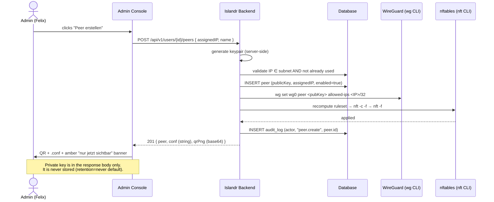
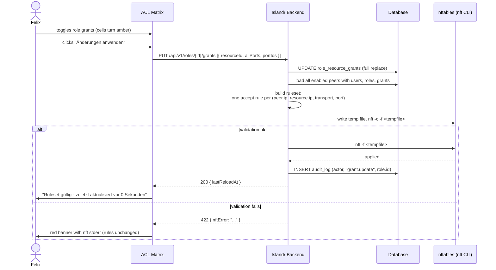
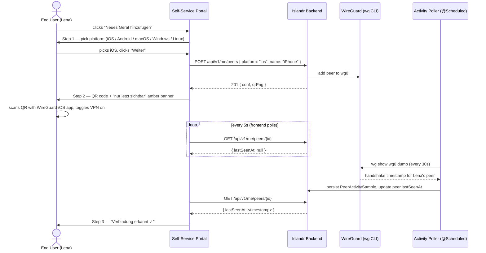
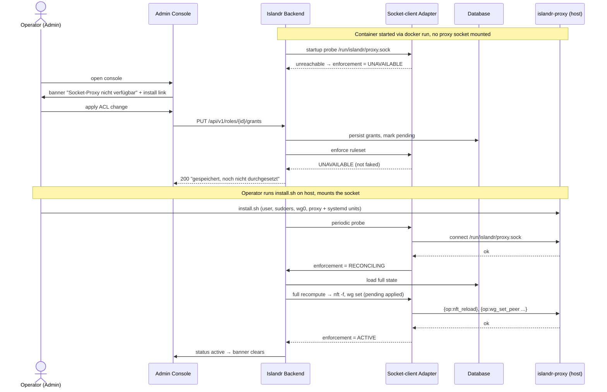
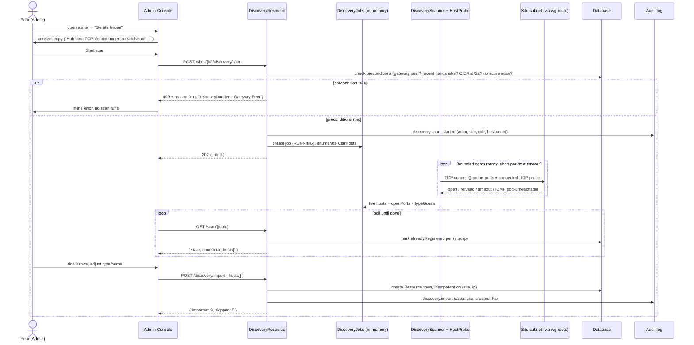

# 6. Runtime View

## 6.1 Peer Creation (Admin)

Felix clicks "Peer erstellen" for a user. The system generates a keypair, assigns an IP, persists the peer, adds it to WireGuard, recomputes nftables, and returns the QR + `.conf` — exactly once.



## 6.2 ACL Change → Atomic nftables Reload

Felix edits grants in the ACL matrix. Cells turn amber (dirty). He clicks "Änderungen anwenden". The system recomputes the full ruleset, validates it, and either applies it atomically or returns the nft error.



## 6.3 End User Adds a Device

Lena opens the Self-Service Portal on her phone and adds a new device via the 3-step flow.



## 6.5 OIDC Login Flow

Felix or Lena opens the Admin Console or Self-Service Portal and logs in via Microsoft 365 (or any configured OIDC provider). This scenario covers the `auth` and `identity` packages, which appear in the Chapter 5 building-block view but are absent from scenarios 6.1–6.4.

1. **Unauthenticated request** — `SessionFilter` detects no valid session, returns `302 → /auth/oidc/login?provider=<id>`.
2. **Authorization request** — `OidcAuthResource` (`auth` package) builds the OIDC authorization URL (client_id, redirect_uri, scope=openid profile email, nonce) and redirects the browser to the provider's authorization endpoint.
3. **Provider authentication** — the user authenticates at the provider (outside Islandr's control).
4. **Callback** — provider redirects to `GET /auth/oidc/callback?code=<code>&state=<state>`. `OidcAuthResource` verifies the `state` parameter against the nonce stored in the pre-auth session.
5. **Token exchange** — `OidcAuthResource` exchanges the authorization code for an ID token via the provider's token endpoint (back-channel HTTPS call).
6. **Token verification** — `IdTokenVerifier` (`identity` package) verifies the ID token: signature via `JwksCache` (cached JWKS from the provider's jwks_uri), expiry, audience, issuer, and nonce.
7. **User lookup / creation** — the verified subject claim is looked up in the `user` package. If no user exists for this OIDC subject, one is created (or the login is rejected if open registration is disabled in settings).
8. **Session creation** — `auth` package creates a session, writes it to the DB, sets an `HttpOnly` session cookie in the response.
9. **Audit log** — `AuditService.log(USER_LOGIN, actor=<subject>)` records the login event.
10. **Redirect to destination** — browser is redirected to the originally requested URL (or `/` as default).

**Error paths:**
- OIDC provider unreachable → token exchange fails → error page shown; local admin account unaffected (§8.5).
- JWKS fetch fails → `JwksCache` retries once before rejecting; transparent for short outages.
- User unknown and auto-registration disabled → login rejected; admin must create the user first.

> A PlantUML sequence diagram for this flow will be added when the project's diagram generation pipeline (`.github/workflows/docs.yml`) is extended to render sequence diagrams from `.puml` files under `docs/arc42/`.

## 6.4 Application Startup

On startup, Islandr runs the following initialization sequence (relevant for ops and troubleshooting):

1. **Flyway** — runs pending migration scripts against the configured datasource.
2. **AdminBootstrap** — if `ISLANDR_ADMIN_PASSWORD` is set and no admin user exists, creates the local admin.
3. **FirewallBootstrap** — reads current DB state and applies the full nftables ruleset (unless `islandr.firewall.boot-apply=false`).
4. **ActivityPoller** — starts the 30-second polling loop.
5. **HTTP server** — Quarkus starts accepting requests on port 8080.

If FirewallBootstrap fails (nft not available, syntax error), Islandr logs the error and starts anyway — the existing kernel rules remain in place. The failure is visible in the Admin Console dashboard.

## 6.6 Configuration without enforcement — Docker, proxy absent (v2)

This is the degraded-mode recovery scenario for the v2 Docker deployment (ADR-0012). The container runs the **configuration plane** even when the `islandr-proxy` socket is absent; the **enforcement plane** activates and reconciles once a proxy connects. It exercises the socket-client `WgAdapter`/`NftAdapter` in their degraded state and the reconcile-on-connect path (BR-027..031).



**Error/recovery characteristics:**
- The container never fails to boot because the proxy is missing — the config plane is independent of enforcement (BR-027).
- Degraded enforcement is honest: the adapter reports `UNAVAILABLE`, it does not fake success (BR-029, closes R-122). Contrast with the dev/CI mock adapter, which *does* fake success and is therefore never used in the published image.
- Recovery is automatic on proxy connect: a full recompute reconciles pending state (BR-030), consistent with the "always full ruleset replacement" rule (BR-025).
- If the host `nft` rejects the reconciled ruleset, enforcement state becomes `FAILED` and the previous host rules stay active — same failure handling as §6.2.
- Alternative exit: instead of installing the proxy, the operator can export the config as JSON and import it into a native install (ADR-0011) — see spec.md UC-04 extension 3a.

## 6.7 Device Discovery — scan a site's CIDR and bulk-import resources

Felix has just connected a new site (a `/24` with nine IP cameras) and does not want to type nine IP/name/port rows by hand. This scenario exercises the `discovery` building block end-to-end and its main error path (a precondition that fails before any probe is sent). It realises UC-05 / F-21 and Business Rules BR-032…BR-037 ([ADR-0014](../adr/0014-device-discovery.md)).



**Error/recovery characteristics:**
- **Fail fast, before any packet** — missing gateway peer, stale handshake, a CIDR larger than `/22`, or a scan already running are all rejected with `409` and specific German copy (BR-034); no probe is sent (T-014).
- **A scan that finds nothing is a result, not an error** — the job ends `done` with an empty list and the UI says so; discovery is best-effort and a fully-filtered host is invisible (R-140, §8.5).
- **Idempotent import** — re-importing a host already present as a `Resource` is a no-op (`skipped`), so a second scan+import never duplicates rows (BR-036).
- **Ephemeral jobs** — a hub restart mid-scan drops the in-memory job (TD-005); the operator simply re-runs it, which is cheap.
- **On the record** — scan start and import are both audited (BR-037, §8.4), because a scan reaches into a remote network.

## 6.7 Device Discovery — scan a site's CIDR and import resources

Felix has a new site with nine cameras and does not want to type nine IPs into the resource form. This scenario exercises the `discovery` package (Chapter 5) end-to-end and covers UC-05 / F-21 / BR-032–BR-037 ([ADR-0014](../adr/0014-device-discovery.md)). The scan uses **unprivileged sockets only** — it never touches `wg`, `nft`, or the socket proxy, so it also works while enforcement is degraded (§6.6).

```mermaid
sequenceDiagram
    actor Felix as Admin
    participant GUI as Admin Console
    participant API as DiscoveryResource
    participant JOB as DiscoveryJobs
    participant SCN as DiscoveryScanner / HostProbe
    participant SITE as Site network (via WireGuard route)
    participant DB as Database
    participant AUD as Audit log

    Felix->>GUI: "Geräte finden" on the site
    GUI->>Felix: consent copy — "Der Hub baut testweise TCP-Ver
