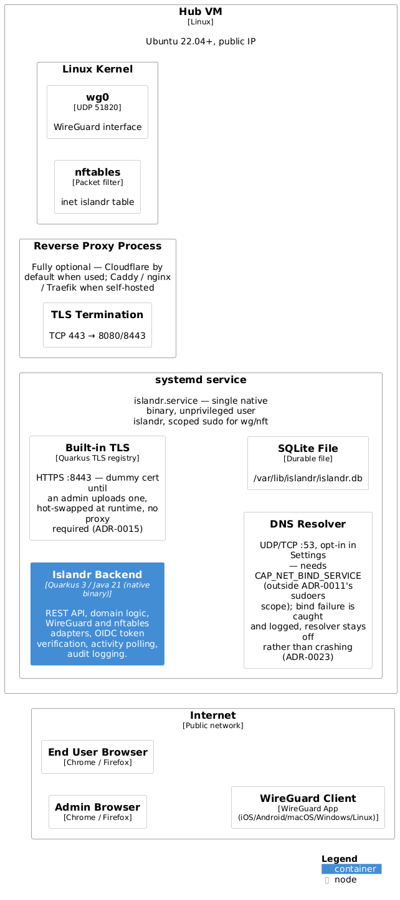
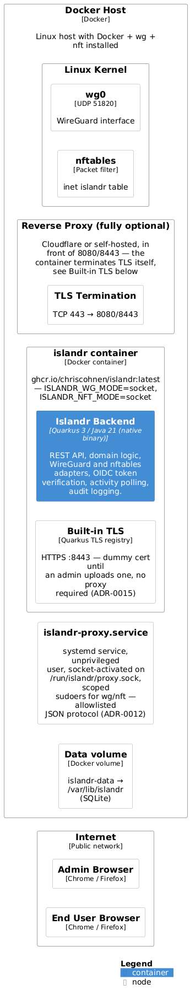

# 7. Deployment View

## 7.1 Production — Hub VM (Single Binary)



### Hub VM requirements

| Requirement | Detail |
|---|---|
| OS | Ubuntu 22.04+ or Debian 12+ |
| WireGuard | Kernel module loaded, interface `wg0` configured |
| nftables | Available, `inet islandr` table managed exclusively by Islandr |
| CPU | 1 vCPU minimum, 2 recommended |
| RAM | 128 MB for the native binary; 256 MB with headroom |
| Disk | Binary ~50 MB + SQLite file (grows with activity samples) |
| Network | Public IP, UDP 51820 open for WireGuard, TCP 443 open for HTTPS |

### Service layout on the hub

```
/usr/local/bin/islandr              ← native binary
/etc/islandr/                       ← config (env file for systemd)
/var/lib/islandr/islandr.db         ← SQLite database
/etc/nftables.conf                  ← stub that loads the islandr table
/etc/systemd/system/islandr.service ← systemd unit
```

### Systemd unit (abbreviated)

```ini
[Service]
User=islandr
Group=islandr
EnvironmentFile=/etc/islandr/env
ExecStart=/usr/local/bin/islandr
Restart=on-failure
AmbientCapabilities=CAP_NET_ADMIN   ; alternative to sudoers entries
```

See [docs/install.md](../install.md) for the full installation guide.

## 7.2 Docker — v1 Demo/Dev Only (Mock Adapters)

A Docker image is published at `ghcr.io/chriscohnen/islandr` for demo and local development. **This image uses mock WireGuard and nftables adapters and cannot manage real peers or firewall rules.**



```yaml
# docker-compose.yml — DEMO / DEV ONLY, not for production use
services:
  islandr:
    image: ghcr.io/chriscohnen/islandr:latest
    ports:
      - "8080:8080"
    volumes:
      - /var/lib/islandr:/data
    environment:
      ISLANDR_WG_MODE: mock     # in-memory only — no real WireGuard
      ISLANDR_NFT_MODE: mock    # in-memory only — no real nftables
      ISLANDR_ADMIN_PASSWORD: "${ISLANDR_ADMIN_PASSWORD}"
      QUARKUS_DATASOURCE_JDBC_URL: jdbc:sqlite:/data/islandr.db
```

### Why Docker is not production-capable in v1

`nft` and `wg` are host kernel tools. Calling them from inside a container requires either:

- `--cap-add NET_ADMIN` + `--network host` — with `--network host`, `CAP_NET_ADMIN` spans **all network namespaces visible to the host**. A compromised islandr process inside such a container can manipulate any nftables table and any network interface on the machine. This is equivalent to running as root on the host network stack. **This violates the least-privilege principle in [ADR-0011](../adr/0011-process-privilege-model.md) and is rejected.**
- Docker socket mount (`/var/run/docker.sock`) — a full host-escape vector; allows spawning `--privileged` containers. Also rejected.

There is no safe way to call host-privileged tools from inside a container without a mediating process that holds the privilege on behalf of the container.

Production deployment of Docker with real adapters is a v2 feature. See below.

## 7.2a Docker — v2 Planned: Unix Socket Proxy (Production-Capable)

In v2, a lightweight **`islandr-proxy`** daemon runs as a systemd service on the host alongside the container. The container mounts only a Unix domain socket — no capabilities, no host network namespace, no Docker socket.

```
Container                             Host
────────────────────────────────────────────────────────────
islandr process
  │
  │  JSON over Unix socket:
  │  {"op":"nft_reload","path":"/var/lib/islandr/ruleset.nft"}
  │  {"op":"wg_set_peer","interface":"wg0","pubkey":"...","allowedIps":"..."}
  │
  └── /run/islandr/proxy.sock ──────► islandr-proxy.service (host, unprivileged user)
                                              │
                                              │  validates: op in allowlist
                                              │  validates: path is /var/lib/islandr/ruleset.nft
                                              │  validates: interface == wg0
                                              │
                                              ├── sudo nft -f /var/lib/islandr/ruleset.nft
                                              └── sudo wg set wg0 peer <pubkey> allowed-ips <cidr>
```

The proxy enforces a strict allowlist of five operations (`nft_reload`, `nft_flush`, `wg_set_peer`, `wg_remove_peer`, `wg_show`). Anything outside this list is rejected. The proxy has no shell and no wildcard exec.

```yaml
# docker-compose.yml — v2 production (planned)
services:
  islandr:
    image: ghcr.io/chriscohnen/islandr:latest
    ports:
      - "8080:8080"
    volumes:
      - /run/islandr/proxy.sock:/run/islandr/proxy.sock   # privileged ops via proxy only
      - /var/lib/islandr:/data
    # no cap_add, no network_mode: host, no privileged
    environment:
      ISLANDR_WG_MODE: real
      ISLANDR_NFT_MODE: real
      ISLANDR_ADMIN_PASSWORD: "${ISLANDR_ADMIN_PASSWORD}"
      QUARKUS_DATASOURCE_JDBC_URL: jdbc:sqlite:/data/islandr.db
```

See [ADR-0012](../adr/0012-docker-socket-proxy.md) for the full rationale, protocol specification, and proxy allowlist.

## 7.3 Development

```
Developer workstation (macOS / Linux)
  └─ ./gradlew quarkusDev
       ├─ Quarkus Live Coding (hot reload)
       ├─ SQLite at ./data/islandr.db  (auto-created)
       ├─ islandr.wg.mode=mock        (no real wg interface needed)
       └─ islandr.nft.mode=mock       (no real nftables needed)
```

The mock adapters simulate WireGuard and nftables in memory. No Linux-specific tools are required on the developer's machine. The full test suite runs with `./gradlew test` using an in-memory SQLite database.

## 7.4 CI/CD

See `.github/workflows/ci.yml`:

- **Stage 1** — `./gradlew test` (JVM, fast, every push and PR)
- **Stage 2a** — Native build amd64 (Mandrel container, triggered on `main` and tags)
- **Stage 2b** — Native build arm64 (triggered on tags only, ~15 min saved per push)
- **Stage 3** — GitHub Release with binaries and checksums (tags only)
- **Stage 4** — Docker multi-arch image pushed to `ghcr.io` (tags only)
