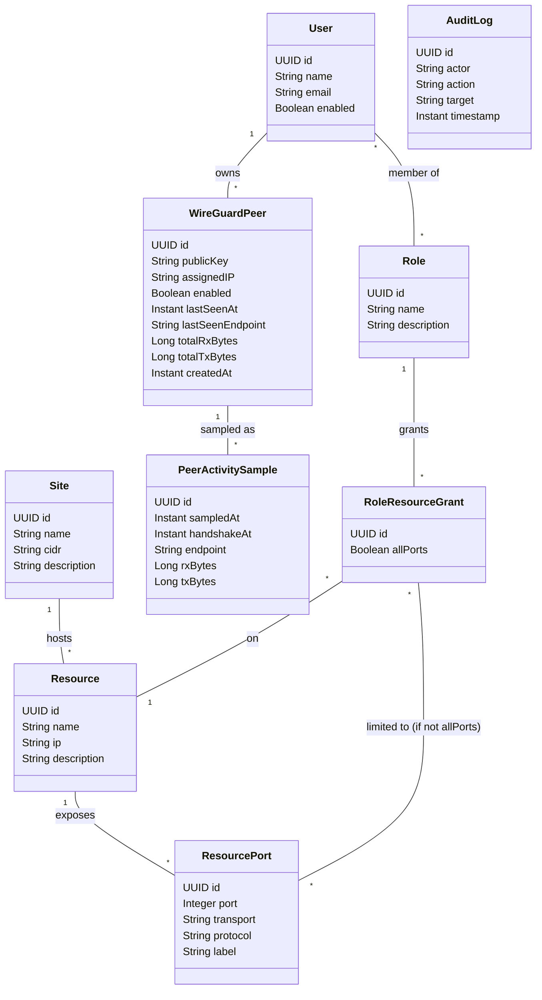
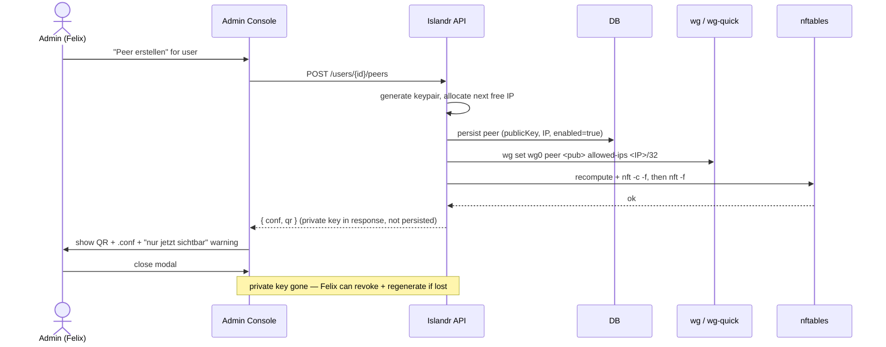
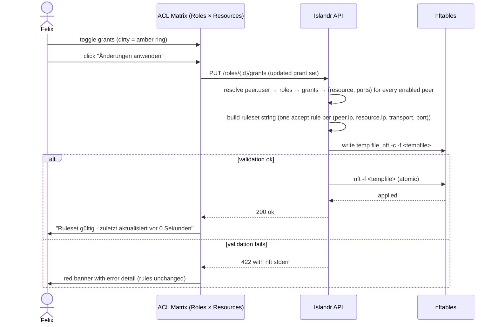
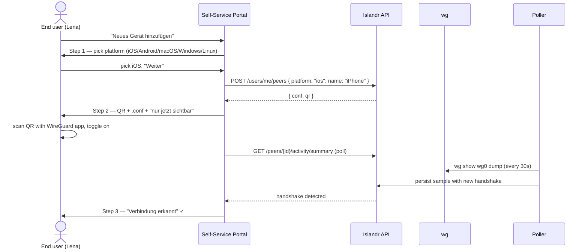

# Islandr — Product Requirements Document

**Status:** Draft v0.1
**Owner:** Christian Cohnen
**Last updated:** 2026-05-30

---

## 1. Problem

Managing WireGuard in a hub-spoke setup — public hub VM + UniFi Cloud Gateway sites + road warrior clients — today requires manual CLI work to:

1. Create and revoke client configs (`wg genkey`, edit `wg0.conf`, restart, email the file)
2. Assign peers to logical groups (no concept exists; admins keep a spreadsheet)
3. Maintain firewall rules on the hub VM that reflect *who* should reach *what* (ufw rules edited by hand, drift from the spreadsheet)

No open-source tool covers all three concerns together — peer management, group-based ACLs, and firewall enforcement — while remaining fully self-hostable and vendor-neutral. wg-easy covers peers but not ACLs. Tailscale and NetBird cover ACLs but lock the control plane into a SaaS or its own coordination server.

The cost of the manual workflow is: errors in firewall rules (drift between spreadsheet and `ufw status`), admin time per onboarding (~10 min of typing, file emailing, follow-up), and a security hole every time a config file is emailed in plaintext.

## 2. Goals

Islandr exists to do four things:

- **G-1** — Replace manual `wg`/`wg-quick` CLI for peer creation with a web UI that generates the keypair, assigns an IP from the pool, and shows the resulting `.conf` + QR code exactly once.
- **G-2** — Model access as **roles granting access to named resources**: a user has one or more roles; roles are granted access to specific resources (machines, services) inside sites; the firewall is recomputed from that model. End users see "RDP zu Terminal-01", not raw CIDR. See [ADR-0006](adr/0006-resource-level-acl.md).
- **G-3** — Generate and atomically reload nftables rules from the ACL model. No drift. No hand-edited rules.
- **G-4** — Give end users a self-service portal where they enroll their own devices via QR/`.conf` without an admin in the loop, with German-language, non-technical wording — and a meaningful access list ("Worauf du zugreifen darfst") in resource-level terms.

### Non-goals (v1)

- **NG-1** — UCG (UniFi Cloud Gateway) API integration. Pulling rules onto UCG from the hub creates an inbound trust path; the hub VM is internet-exposed and we don't trust it that far. See [ADR-0005](adr/0005-hub-only-firewall.md). A pull-mode agent inside the trusted network is planned for v2.
- **NG-2** — Multi-hub / mesh topology. v1 is single-hub.
- **NG-3** — Keycloak/Authentik federation. OIDC for Microsoft 365 / Entra ID and Google is implemented in v1 (runtime-configurable, no restart). Generic OIDC and Keycloak/Authentik are v2.
- **NG-4** — Billing, metering, multi-tenancy.

## 3. Personas

### P-1: Felix, Sysadmin
Mid-30s, runs IT for a 30–80 person company or a technical home setup. Comfortable with the Linux CLI but tired of editing `wg0.conf` by hand. Lives in the terminal and the Admin Console in roughly equal measure. Wants dense, data-rich screens and exact information (IPs, public keys, handshake times in absolute timestamps on hover). Often works in dark mode.

**Primary surface:** Admin Console.
**Success looks like:** Onboarding a new employee's laptop takes under two minutes — pick user, click "Peer erstellen", hand them the QR. Revoking access takes one click and the firewall is correct within 1 second.

### P-2: Lena, End User
Knowledge worker, German-speaking, not technical. Knows what a Wi-Fi password is. Has heard of "VPN" but couldn't explain it. Was told by IT to "set this up on your laptop and your phone". Will give up if she sees the word `CIDR` or `Public Key`.

**Primary surface:** Self-Service Portal.
**Success looks like:** She logs in with her Microsoft account (or a magic link). She sees "Hallo, Lena" and a list of her devices. She adds a new device by picking her phone's OS, scanning a QR code, and seeing "Verbindung erkannt".

### P-3: Tom, Power User (secondary)
Technical employee, comfortable with the CLI but not an admin. Wants to download a `.conf` for his Linux workstation rather than scan a QR. Doesn't need much hand-holding but appreciates not having to email his admin.

**Primary surface:** Self-Service Portal (the same one Lena uses — Tom just uses the `.conf` download path).

## 4. Success criteria

| ID | Criterion | Measurement |
|----|-----------|-------------|
| S-1 | Onboarding a new peer takes under 2 minutes from "user exists" to "QR shown" | Stopwatch on Felix's workflow |
| S-2 | Disabling a peer drops its packets at the hub within 1 second | `tcpdump` on hub during disable click |
| S-3 | ACL changes produce a valid nftables ruleset and zero-downtime atomic reload | `nft -c -f` validation passes; existing connections survive reload |
| S-4 | A non-technical end user adds a device without help | Lena onboards a phone without messaging Felix |
| S-5 | Audit log captures every mutating action with actor, action, target, timestamp | Every state-changing API call has a corresponding audit entry |
| S-6 | Backend runs as a single binary, no JVM install required on the hub VM | `./islandr` starts cleanly on a fresh Ubuntu 24.04 VM |

## 5. Scope — Functional Requirements

Format: EARS (Easy Approach to Requirements Syntax) where it fits cleanly; plain "shall" otherwise. IDs match the original RFC where possible.

### Peer management
- **F-01** — When an admin submits the create-user form, the system shall create a user with name, email, and enabled=true.
- **F-02** — When an admin requests a new peer for a user, the system shall generate a WireGuard keypair server-side, validate the admin-supplied IP (must be inside the configured subnet, must not already be assigned to another peer), persist the peer with `publicKey` and `assignedIP`, and add it to the running `wg` interface.
- **F-03** — The create-peer response shall return the generated `.conf` body, the private key (inline), and a QR PNG as a base64 data URL. Whether the private key is also retained server-side depends on the configured **retention mode** (see [ADR-0007](adr/0007-private-key-retention.md)):
  - `never` (default) — the private key exists only in the create-peer response body and is never persisted. If the user loses the artefact before scanning, the only recovery is to regenerate the peer. Matches N-06 strictly.
  - `plaintext` — the private key is stored in the `peers` table unencrypted, allowing a `GET /peers/{id}/conf` endpoint to re-render the `.conf` and QR on demand. PiVPN-equivalent behaviour. Operator opts in deliberately.
  Retention mode is an instance-wide setting, not per-peer. `encrypted` mode is deferred to v2.
- **F-04** — When an admin disables a peer, the system shall remove the peer from the running `wg` interface and recompute the nftables ruleset, while retaining the peer's public key and assigned IP in the database.
- **F-05** — When an admin deletes a peer, the system shall remove it from `wg`, from the database, and from the nftables ruleset, and shall write an audit entry naming the actor.

### Roles, sites, resources, ACLs
- **F-06** — The system shall allow admins to create roles (e.g. `Vertrieb`, `IT-Admin`) and assign users to roles (many-to-many).
- **F-07** — The system shall allow admins to define sites by name + CIDR. A site represents one logical remote network reachable through the hub (e.g. "Headquarter LAN", "Datacenter A"). Routing into the site is configured on the UCG side; Islandr only references the CIDR for `AllowedIPs` rendering.
- **F-07a** — The system shall allow admins to define resources within a site by name + IP + description (e.g. "Terminal-01" at `10.20.0.5`). A resource always belongs to exactly one site.
- **F-07b** — The system shall allow admins to declare one or more reachable ports on a resource. Each `ResourcePort` carries `port`, `transport` (`tcp`/`udp`), a `protocol` label (`RDP`, `SSH`, `SFTP`, `X11`, `HTTP`, `HTTPS`, `SMB`, free-text custom), and an optional human label.
- **F-07c** — The system shall allow admins to grant a role access to a resource. A grant is either *all ports* (the role can reach every current and future port of the resource) or *limited* (the role can only reach an explicit subset of the resource's ports).
- **F-08** — When the ACL model changes (peer added/removed/disabled/re-enabled, user role-membership changes, role grants change, resource/port changes, site CIDR changes), the system shall recompute the full nftables ruleset from the resource grants, validate it via `nft -c -f`, and atomically reload it via `nft -f`. If validation fails, the system shall keep the existing rules and surface the error in the UI.
- **F-08a** — Enforcement granularity is `(peer source IP, resource IP, transport, port)`. The `protocol` label on a `ResourcePort` is descriptive metadata for the UI and is **not** enforced at L7 — a tunneled different protocol on the same port is not detected. See [ADR-0006](adr/0006-resource-level-acl.md) §"What this does not protect against".

### Activity
- **F-09** — The system shall display peer status: last handshake (live from `wg show`), enabled/disabled, online (handshake ≤3 min) / stale / offline.
- **F-11** — The system shall poll `wg show <iface> dump` on a configurable interval (default 30s), diff the result against the last sample, and persist per-peer activity samples (handshake timestamp, endpoint, rx/tx byte counters).
- **F-12** — The peer list shall show last-seen as a relative string (`vor 12 Sekunden`, `vor 2 Std`, `vor 3 Tagen`, `nie`) with absolute time on hover, and shall color "active" peers (handshake ≤3 min) distinctly.
- **F-13** — The peer detail view shall show an activity timeline over a configurable window (default 30 days) with a traffic chart and handshake events.
- **F-14** — The Self-Service Portal shall show the end user, for each of their own devices, when it last connected, from where (city/IP, depending on privacy setting), and how much traffic.
- **F-15** — Activity samples shall be subject to a configurable retention policy (default 30 days). Aggregated lifetime counters on the peer (`totalRxBytes`, `totalTxBytes`, `lastSeenAt`) shall be preserved indefinitely.

### Audit
- **F-10** — Every mutating action (create/disable/delete peer, create/update/delete user/role/site/resource/resource-port, role membership change, role grant change) shall append an immutable entry to the audit log with actor, action, target, and timestamp.

### Self-Service
- **F-16** — End users shall authenticate via the configured identity provider (OIDC: Microsoft 365 / Google) or, where no OIDC provider is active, via local password. The Portal shall show only the user's own devices and own access list — never another user's data.
- **F-17** — End users shall be able to add a new device through a 3-step flow: pick platform → see QR + `.conf` (one-time-secret pattern) → wait for first handshake → success.
- **F-18** — The Portal shall describe accessible resources in plain language, grouped by site. Each line shows resource name, an icon for the (UI-level) protocol label, and a human description — never raw CIDR. Example: "Terminal-01 — RDP", "NAS-Backup — SFTP".

### Authorisation
- **F-19** — Every user has exactly one system role: `ADMIN` or `END_USER` (see [domain model §7](#7-domain-model)). `ADMIN` reaches the Admin Console; `END_USER` reaches the Self-Service Portal only. System role is enforced server-side on every API call, not only in the UI.

## 6. Non-Functional Requirements

| ID | Requirement |
|----|-------------|
| N-01 | Fully self-hostable. No external service dependencies at runtime. (CDN fonts are out — self-host IBM Plex per the design brief.) |
| N-02 | Backend runs on Linux (Ubuntu/Debian 22.04+, Java 21 or as a native binary). |
| N-03 | Backend ships as a single binary (Quarkus native build via GraalVM) for production. |
| N-04 | Web UI accessible over HTTPS only. TLS termination at Caddy or a reverse proxy. |
| N-05 | API is RESTful JSON, suitable for scripting and the future pull-mode agent. |
| N-06 | Peer private keys are shown exactly once and not stored in plaintext. If retained at all (for re-display before first handshake), they are encrypted at rest with an admin-provided key. |
| N-07 | Audit log is append-only and accessible in the UI. |
| N-08 | All UI text is German, informal `Du`. No emoji. Status is icon + label, never color alone. |
| N-09 | Light and dark theme are equal-weight and ship together in v1. |
| N-10 | Both themes meet WCAG AA: text contrast ≥4.5:1, large text ≥3:1, visible `:focus-visible` ring. |

## 7. Domain model

The model implements **NIST RBAC0 (Core RBAC)** with three primitives:

- **Subjects (who)** — `User`, assigned to one or more `Role`s.
- **Objects (what is being protected)** — `Resource`s (concrete machines/services with an IP), exposing one or more `ResourcePort`s. Resources are organised under `Site`s for browsing and routing.
- **Permissions (what is allowed)** — modelled as `RoleResourceGrant`. A grant binds a `Role` to a `Resource` (and optionally to a subset of its `ResourcePort`s).

Permissions never attach to a `User` directly. Adding a new employee to "Vertrieb" gives them every Vertrieb grant in one step; revoking the role revokes everything. This is the load-bearing benefit of RBAC over per-user permission lists and is the reason the role layer exists.

Role hierarchy (RBAC1: "IT-Admin inherits from Entwickler") and constraints (RBAC2/3: separation-of-duties, mutual exclusion) are out of scope for v1. They can be added later without restructuring the core model.

> **Protocol semantics:** `ResourcePort` carries a `protocol` label (`RDP`, `SSH`, `SFTP`, `X11`, `HTTP`, …) used by the UI to render meaningful access lists ("RDP zu Terminal-01"). Enforcement is purely at the `(saddr, daddr, dport, proto-tcp|udp)` level on nftables. The protocol *label* is descriptive metadata, not a security control. See [ADR-0006](adr/0006-resource-level-acl.md) for the rationale and what this does *not* protect against.



### Field semantics

| Entity | Field | Notes |
|---|---|---|
| `Role` | `name` | E.g. `Vertrieb`, `IT-Admin`, `Entwicklung`. Job-function naming per NIST RBAC convention. |
| `Site` | `cidr` | The remote subnet reachable through one or more static UCG-side tunnels. Routing is configured on the UCG; Islandr only references it. |
| `Resource` | `ip` | A single host inside a Site's `cidr`. v1 supports IPv4 only. |
| `ResourcePort` | `transport` | `tcp` or `udp`. Required — nftables needs it. |
| `ResourcePort` | `protocol` | Free-text label (`RDP`, `SSH`, `SFTP`, `X11`, `HTTP`, `HTTPS`, `SMB`, custom). UI-only. |
| `ResourcePort` | `label` | Optional human override of the auto-rendered "RDP zu Terminal-01" line. |
| `RoleResourceGrant` | `allPorts` | If `true`, the role can reach every `ResourcePort` of the resource (current and future). If `false`, the grant is limited to the explicit `ResourcePort` set. |

### System roles for application authorization

The `Role` entity above models **access roles** (job functions). Application-level authorisation — who may use the Admin Console vs. who is restricted to the Self-Service Portal — uses a separate, fixed enum:

| System role | Meaning |
|---|---|
| `ADMIN` | Full Admin Console access. Manages users, roles, sites, resources, ACLs, audit. |
| `END_USER` | Self-Service Portal only. Sees own peers, own access list. |

System role is stored on `User` and not modelled as an entity — see [ADR-0006](adr/0006-resource-level-acl.md) for why this stays a closed enum in v1.

### ACL resolution

```
peer.user → user.roles → role.grants → grant.resource (+ optional grant.ports) → nftables rules
```

On every relevant change (peer create/disable/delete/re-enable, user role-membership change, role grant change, resource/port change, site-cidr change), the backend resolves this graph and performs a full ruleset recompute + atomic reload via `nft -f`. There is no partial-rule update path — the ruleset is always a function of current DB state.

The generated rules target the *resource* tuple, not the *site* CIDR:

```
iifname "wg0" ip saddr <peer.assignedIP> ip daddr <resource.ip> <transport> dport <port> accept
```

A `Role` grant with `allPorts=true` produces one rule per declared `ResourcePort`. A site's `cidr` is only used at the UI level (grouping resources by site) and for the `AllowedIPs` block in the peer's `.conf` (so the OS routing table sends matching destinations into the tunnel). It is never used as an nftables target by itself.

### Why two activity tables

WireGuard doesn't persist session history. `wg show` reports only the most recent handshake per peer, and `wg-quick down` wipes the in-kernel state. To answer "when did Lena's laptop last connect?" or "show me usage over 7 days", the poller writes:

1. **Aggregated state on `WireGuardPeer`** (`lastSeenAt`, `totalRxBytes/TxBytes`) — survives `wg` restarts, fast to read.
2. **Time-series in `PeerActivitySample`** — bounded retention (30d default), for charts and timelines.

Live "is this peer connected right now" is still answered from `wg show` directly (handshake ≤3 min = active).

## 8. Key flows

### F-A: Admin creates a peer



### F-B: ACL change → atomic nftables reload

The Admin Console exposes a "Rollen × Ressourcen" matrix instead of the earlier "Gruppen × Netzwerke" one. Cells are tri-state per resource: ∅ (no access) / ⓐ (all ports) / N (specific port count); clicking a cell opens a port-picker if the resource has more than one declared port.



### F-C: End user adds a device



## 9. REST API (v1, shape only)

Shape only — request/response bodies are defined by the implementation. arc42 architecture documentation is planned separately.

```
# --- Users ---------------------------------------------------------------
GET    /api/v1/users
POST   /api/v1/users
GET    /api/v1/users/{id}
DELETE /api/v1/users/{id}
PUT    /api/v1/users/{id}/system-role           # ADMIN | END_USER

# --- Peers ---------------------------------------------------------------
GET    /api/v1/peers
POST   /api/v1/users/{id}/peers                 # response: { peer, conf (string),
                                                #            qrPng (base64 data URL) }
                                                # — private key embedded in conf + qrPng only
                                                # — no follow-up endpoint returns this material
GET    /api/v1/peers/{id}                       # metadata only (no key material)
GET    /api/v1/peers/{id}/conf                  # re-render .conf + QR
                                                # 200 only in retention=plaintext mode
                                                # 404 in retention=never mode
PUT    /api/v1/peers/{id}/enabled
DELETE /api/v1/peers/{id}
GET    /api/v1/peers/{id}/activity?from=&to=
GET    /api/v1/peers/{id}/activity/summary

# --- Roles ---------------------------------------------------------------
GET    /api/v1/roles
POST   /api/v1/roles
GET    /api/v1/roles/{id}                       # incl. members + grants
PUT    /api/v1/roles/{id}                       # name/description
DELETE /api/v1/roles/{id}
PUT    /api/v1/roles/{id}/members               # full set; user IDs
GET    /api/v1/roles/{id}/grants
PUT    /api/v1/roles/{id}/grants                # full set; triggers nftables recompute

# --- Sites + Resources ---------------------------------------------------
GET    /api/v1/sites
POST   /api/v1/sites
PUT    /api/v1/sites/{id}                       # name, cidr, description
DELETE /api/v1/sites/{id}

GET    /api/v1/sites/{id}/resources
POST   /api/v1/sites/{id}/resources
GET    /api/v1/resources/{id}
PUT    /api/v1/resources/{id}
DELETE /api/v1/resources/{id}

GET    /api/v1/resources/{id}/ports
POST   /api/v1/resources/{id}/ports
PUT    /api/v1/ports/{id}
DELETE /api/v1/ports/{id}

# --- Self-Service (end user, scoped to own user) -------------------------
GET    /api/v1/me                               # profile, system role, roles
GET    /api/v1/me/peers
POST   /api/v1/me/peers
GET    /api/v1/me/access                        # resolved resource list, grouped by site

# --- System --------------------------------------------------------------
GET    /api/v1/audit
GET    /api/v1/status                           # wg interface state, nftables status, last reload

# --- Instance settings (admin-editable runtime config) -------------------
GET    /api/v1/settings                         # current values + setupComplete flag
PUT    /api/v1/settings                         # update all fields atomically, audit-logged
                                                # See ADR-0008.
```

## 10. Security model (summary)

Summary only — a full STRIDE threat model is planned in the arc42 architecture documentation. The principle:

**The hub VM is the trust boundary.** It is internet-exposed and must be treated as a potential compromise target.

- No UCG credentials on the hub VM. The hub VM never calls the UCG API. ([ADR-0005](adr/0005-hub-only-firewall.md))
- UCG site tunnels are static, configured on the UCG side.
- nftables on the hub controls only what reaches the hub's interfaces. Internal LAN segmentation stays under UCG control.
- v2 introduces a pull-mode agent inside the trusted network: it polls Islandr for ACL changes and applies them to the UCG locally. The trust direction is trusted-pulls-from-untrusted, never the reverse.

## 11. Open questions

- ~~**OQ-1** — Private key retention~~ **Resolved 2026-05-30** (revised again): instance-wide setting `private_key_retention` in the [settings table](adr/0008-runtime-settings-in-db.md) with two values in v1: `never` (default — matches strict N-06) and `plaintext` (PiVPN-equivalent — re-display via `GET /peers/{id}/conf`). Editable in the Admin Console; audited. `encrypted` mode deferred to v2 to avoid master-key management complexity. Full rationale and tradeoff matrix in [ADR-0007](adr/0007-private-key-retention.md).
- **OQ-2** — Frontend build pipeline: Quarkus Quinoa (transparent npm-under-the-hood, against the spirit of the constraint) vs. esbuild standalone vs. CDN ESM with `<script type="importmap">` in production. Resolve in [ADR-0002](adr/0002-vue-without-npm.md) once explored.
- **OQ-3** — Authentication for v1: local password only, or magic link from day one? Magic link needs SMTP, which adds a config surface.
- **OQ-4** — License choice: EUPL-1.2 vs. Apache-2.0. Wait until first external interest.
- **OQ-5** — How are admins themselves provisioned in v1 (first-run setup, `islandr admin add` CLI, env var bootstrap)? Affects N-06 and the onboarding flow.
- ~~**OQ-6** — IP allocation strategy for peers~~ **Resolved 2026-05-30:** admin enters the IP explicitly in the create-peer form, the same way they enter a Resource IP. Backend validates `IP ∈ subnet` and `IP not already used by another peer`. No auto-allocation in v1. Rationale: admins of this scale already know which IP slot they want; auto-allocation adds a "next free IP" state machine for one click of saved typing.
